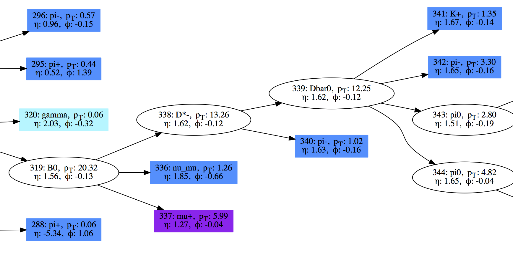
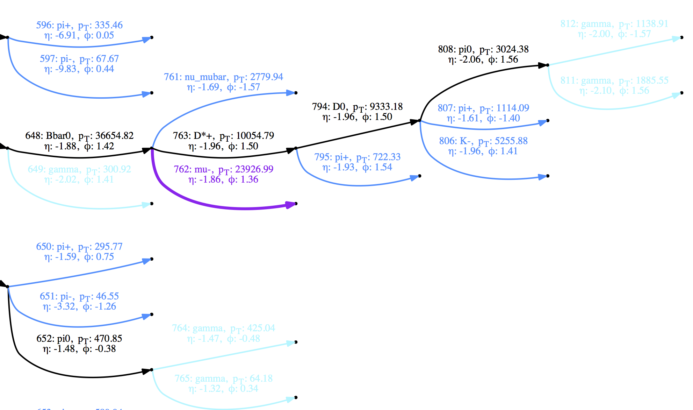

PythiaPlotter
=============

|Supports python 2.7, 3.4, 3.5, 3.6| |Travis Build Status|

What Is It
----------

Plots diagrams of particle decay trees from HEP Monte Carlo (MC) events.
Very handy to figure out what is actually going on in your MC!

Some snippets from the full examples in the `example <https://github.com/raggleton/PythiaPlotter/tree/master/example>`_ folder:

What Can I Give It To Plot?
---------------------------

PythiaPlotter currently supports:

*  Pythia 8 STDOUT (i.e. the big particle event table) (e.g. `example/example\_pythia8.txt <https://github.com/raggleton/PythiaPlotter/tree/master/example/example_pythia8.txt>`_)
*  HepMC files (e.g. `example/example\_hepmc.hepmc <https://github.com/raggleton/PythiaPlotter/tree/master/example/example_hepmc.hepmc>`_)
*  LHE files (e.g. `example/example\_lhe.lhe <https://github.com/raggleton/PythiaPlotter/tree/master/example/example_lhe.lhe>`_)
*  ParticleListDrawer STDOUT as output by CMSSW (e.g. `example/example\_cmssw.txt <https://github.com/raggleton/PythiaPlotter/tree/master/example/example_cmssw.txt>`_)
*  Heppy ROOT files - requires a special module to add mother/daughter relationships (e.g. `example/example\_heppy.root <https://github.com/raggleton/PythiaPlotter/tree/master/example/example_heppy.root>`_)

What Do I Need:
---------------

*  Currently, both python 2.7 and python >=3.4 are supported (although
   the Heppy input is only supported by python 2.7 due to ROOT
   limitations)
*  `graphviz <http://www.graphviz.org>`__ (If the command ``which dot``
   returns a filepath, you will be fine)
*  `PyROOT <https://root.cern.ch/>`__ if you want to parse Heppy ROOT
   NTuples. Note that if you are in a virtualenv, you will need to
   enable global site packages. If ROOT cannot be found, then the
   ``--inputFormat HEPPY`` option will be disabled.
*  All other required python packages will be installed automatically

How Do I Get It:
----------------

*  The easiest way is to use ``pip``:

::

    pip install git+https://github.com/raggleton/PythiaPlotter.git

*  It can also be cloned from Github and installed locally from the base
   directory:

::

    make install

* If you *really* can't install it, it is also possible to clone and run it in the main PythiaPlotter directory by doing:

::

    python -m pythiaplotter

However this is the least recommended way, as you must be in the specific `PythiaPlotter` directory.

How Do I Use It:
----------------

Example usage (requires downloading the example input files in the
`example <https://github.com/raggleton/PythiaPlotter/tree/master/example>`__ directory)

::

    PythiaPlotter example/example_pythia8.txt --open --inputFormat PYTHIA
    PythiaPlotter example/example_hepmc.hepmc --open --inputFormat HEPMC

    # to show all options:
    PythiaPlotter --help

There are various input (**parser**) and output (**printer**) options.
Although only 1 printer, ``dot``, is currently implemented, more are
envisaged. You should specify the input format using ``--inputFormat``
(although it does try to guess), and and output printer using ``-p``
(defaults to DOT). There are also other options for specifying the
output filename and format.

MC generators often internally make several sequential copies of a
particle, updating it as the event evolves. For our purposes, these are
redundant particles that add no information, and just make things more
complicated. Therefore they are removed by default. To keep these
redundant particles use the ``--redundants`` flag.

Advanced: particle representations
~~~~~~~~~~~~~~~~~~~~~~~~~~~~~~~~~~

Briefly, particles can be represented as **nodes** (graphically
represented as a dot or blob) or **edges** (a line). In a generic graph,
edges join together nodes, and may or may not have a direction. Here, we
make use of the directionality of edges.

*  **Node representation**: edges indicate a relationship between
   particles, where the direction may be read as "produces" or "decays
   into". For example, ``a ->- b`` represents ``a`` decaying into ``b``.

*  **Edge representation**: edges represent particles, like in a Feynman
   diagram. Nodes therefore join connected particles, such that all
   **incoming** edges into a node may be seen a "producing" or "decaying
   into" all **outgoing** edges.

This difference is that input formats naturally fall into one of the two
representations. Pythia8, LHE, Heppy are all in the **node
representation**, whilst HepMC is in the **edge representation**. Included
in this program is the possibility to convert from the default
representation into the other representation using the
``-r {NODE, EDGE}`` option. This can be useful to help elucidate what's
going on in an event.

Note that redundant particle removal is done *after* representation
conversion.

What Improvements Are Being Working On:
---------------------------------------

*  Parser: More parsers? Some under-the-hood magic for faster/safer
   processing
*  Printer: JS? TikZ/Latex printer for more formatting and more
   beautiful output?

Full documentation:
-------------------

See `readthedocs <http://pythiaplotter.readthedocs.io/en/latest/>`_

.. |Supports python 2.7, 3.4, 3.5, 3.6| image:: https://img.shields.io/pypi/pyversions/Django.svg
.. |Travis Build Status| image:: https://travis-ci.org/raggleton/PythiaPlotter.svg?branch=proper_restructure
